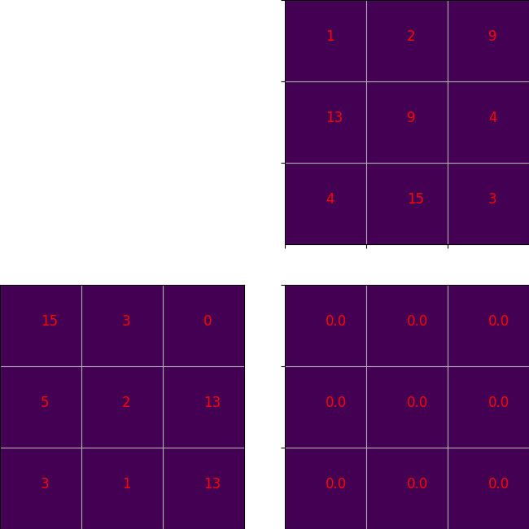
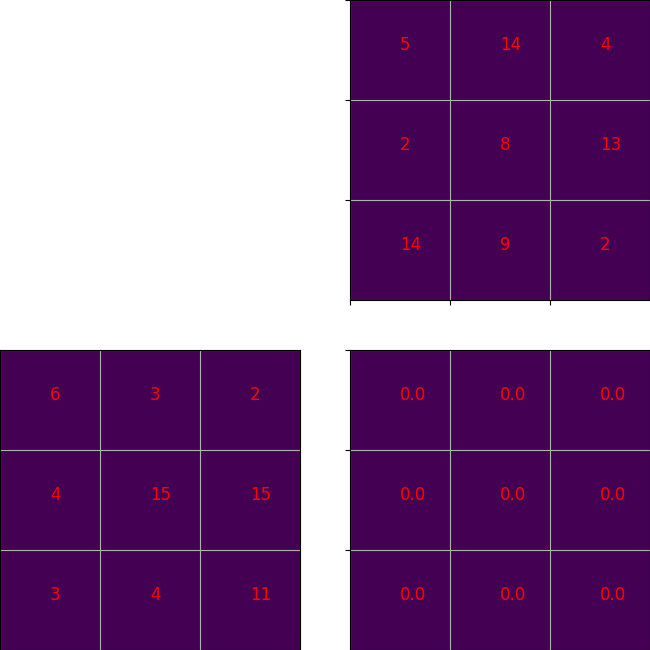
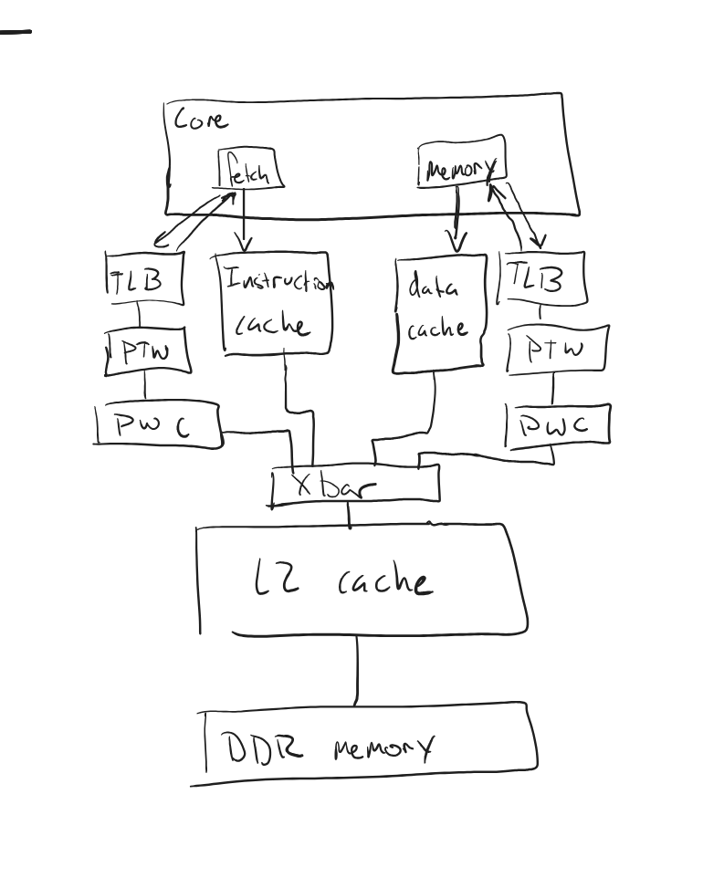

**Due on Monday June 2 11:59 pm (PST)**: See [Submission](#submission) for details

## Table of Contents

- [Introduction](#introduction)
- [Research Question](#research-question)
- [Workloads](#workloads)
- [System under simulation](#system-under-simulation)
- [Experimental Setup](#experimental-setup)
- [Analysis and Simulation](#analysis-and-simulation)
  - [Step I: Hypothesis: Understanding the Virtual Memory System](#step-ii-hypothesis-understanding-the-virtual-memory-system)
  - [Step II: Basic Performance Analysis](#step-iii-basic-performance-analysis)
  - [Step III: Design Space Exploration](#step-iv-design-space-exploration)
  - [Answering the Research Question](#answering-the-research-question)
- [Extra Credit: A comparison between syscall emulation and full system](#step-i-a-comparison-between-syscall-emulation-and-full-system)
  - [Run in SE mode](#run-in-se-mode)
  - [Run in FS mode](#run-in-fs-mode)
  - [Compare SE and FS modes](#compare-se-and-fs-modes)
- [Hints](#hints)
  - [Useful stats](#useful-stats)
- [Submission](#submission)
  - [Explanation of How to Use Your Script](#explanation-of-how-to-use-your-script)
- [Grading](#grading)
- [Academic Misconduct Reminder](#academic-misconduct-reminder)

## Introduction

In this assignment, you will explore the design space of virtual memory
translation caches. You will:

- Learn how different TLB configurations affect system performance
- Understand the tradeoffs between TLB size and page walk cache configurations
- Analyze how different workloads stress the virtual memory system differently

Virtual memory translation is a critical component of modern computer systems.
Every memory access requires translating a virtual address to a physical
address. To make this translation fast, systems employ translation lookaside
buffers (TLBs) and page walk caches.

## Research Question

**Should we allocate area to a TLB or to the page walk cache?**

To answer this question, you will need to simulate different configurations of
TLBs and page walk caches and measure their impact on system performance.

## Workloads

You will use two different workloads for this assignment:

1. Breadth-first search (BFS)

   - Memory intensive with irregular access patterns
   - Large working set size
   - Available as `bfs_x86_run` or `bfs_fs_run`

2. Matrix multiplication with blocked layout (MM-Block-IK)
   - Regular memory access patterns
   - Moderate working set size
   - Available as `mm_block_ik_x86_run` or `mm_block_ik_fs_run`

Both workloads are available in syscall emulation (SE) and full system (FS)
modes.

### Matrix Multiplication and caching
There are multiple techniques for matrix multiplication that can affect the overall system performance due to their differing memory access patterns.

#### Base matrix multiplication algorithm (C stationary, or ijk)

In programming, matrices are stored as two-dimensional arrays.
Otherwise, a matrix is stored as an array of arrays.
There are two ways how a matrix could be stored this way.

- Row major order: the matrix is represented as an array of the rows of the matrix.
Each row is then stored as an array that includes elements from consecutive columns in the row.
With this order, consecutive access to the elements in a row exhibits spatial locality.
- Column major order: the matrix is represented as an array of the columns of the matrix.
Each column is then stored as an array that includes elements from consecutive rows in the column.
With this order, consecutive access to the elements in a column exhibits spatial locality.

Below is a simple implementation of matrix multiplication given in `workloads/matmul/ijk_multiply.h`.
For this assignment, assume that all `A`, `B`, and `C` matrices are stored in row-major order.
I.e., matrices are indexed like `A[row number][column number]`.
The starter code first iterates over the rows of `A` (*i*), then iterates over the columns of `B` (*j*), and then iterates over the elements in the selected row and column (*k*).

```cpp
void multiply(double **A, double **B, double **C, int size)
{
    for (int i = 0; i < size; i++) {
        for (int j = 0; j < size; j++) {
            for (int k = 0; k < size; k++) {
                C[i][j] += A[i][k] * B[k][j];
            }
        }
    }
}
```

The animation below shows how the order of operations during the multiplication operation.



#### A stationary matrix multiplication (ikj)
As you can see in the animation, the previous implementation of the matrix multiplication does not expose much locality in its accesses to matrices `A` and `B`.
Rather, it exposes locality when accessing matrix `C`.
We can reorder our nested loops and still get the correct answer.
In fact, all permutations of our three nested loops will result in the same `C` matrix.
Moreover, when it comes to the complexity of the algorithm itself, reordering the for loops does not change the complexity.
However, reordering the for loops changes the access pattern to the memory.
In turn, it could increase/decrease our cache hit rate.
For this step, you can see a slightly different implementation of the matrix multiplication program below.
You can also find it in `workloads/matmul/ikj_multiply.h`

```cpp
void multiply(double **A, double **B, double **C, int size)
{
    for (int i = 0; i < size; i++) {
        for (int k = 0; k < size; k++) {
            for (int j = 0; j < size; j++) {
                C[i][j] += A[i][k] * B[k][j];
            }
        }
    }
}
```

As you can see, two for loops have been interchanged (*j* and *k*) from our previous implementation.
The animation below shows how the order of operations during the multiplication operation.



#### Blocked matrix multiplication 

You can improve the cache behavior of matrix multiplication by using a blocked algorithm.
In this algorithm, rather than streaming through all of the inputs, you operate on one *block* at a time.
Look at [this short article](https://csapp.cs.cmu.edu/public/waside/waside-blocking.pdf) to learn more about the blocking technique used to increase locality in matrix multiplication.

Similar to loop interchange, there are multiple different ways you can choose to block accesses to your matrices in the matrix multiplication algorithm.
One example is shown below where `j` and `k` are blocked and `i` is streamed. Note that the workload for this assignment is blocked over `i` and `k` so this animation is not entirely representative of the workload for the assignment.


1. Describe the advantages of a blocked matrix multiplication algorithm versus a
   standard matrix multiplication algorithm. Specifically, describe why cache performance would improve when using a blocked algorithm.
2. Would increasing the cache size provide a greater performance benefit for a
   blocked matrix multiplication algorithm or a standard matrix multiplication algorithm? Justify your answer. (Note that this hypothetical is not investigated in this assignment, but we are still looking for a reasonable hypothesis and justification)


## System under simulation

The system you are simulating looks something like the picture below:



## Experimental Setup

You will use the following configuration for your experiments:

- Board: X86Board
- Memory: DDR4 with 3GB capacity
- Cache Hierarchy: Two configurations
  - SmallPWCHierarchy: Small page walk cache configuration
  - LargePWCHierarchy: Large page walk cache configuration
- TLB Configurations:
  - 16 entries (small)
  - 32 entries (large)
- Clock frequency: 3 GHz

The provided `run.py` script allows you to configure these parameters.

## Analysis and Simulation

Complete the following steps and answer the questions for your report.

### Step I: Hypothesis: Understanding the Virtual Memory System

Before running any experiments:

1. What do you expect to happen to performance as you increase the TLB size?
   Why?
2. What do you expect to happen to performance as you increase the page walk
   cache size? Why?
3. Do you expect increasing the TLB size to have a larger impact on performance
   than increasing the page walk cache size? Why or why not? Use AMAT to justify
   your answer (Look at the [Hints](#hints) section for more on calculating
   AMAT).

### Step II: Basic Performance Analysis

Run both workloads with the small TLB (16 entries) and small page walk cache
configuration.

1. What is the TLB miss rate for each workload?
2. What is the average page walk latency for each workload, i.e., what is the
   the AMAT of a TLB miss?
3. What percentage of execution time is spent handling TLB misses? (Hint:
   compare the performance of SE mode and FS mode to get an approximation of the
   time spent handling TLB misses.)

### Step III: Design Space Exploration

Run experiments varying both TLB size and page walk cache configuration.

1. For each workload, what is the performance impact of:
   - Doubling the TLB size (16 to 32 entries)
   - Using the large page walk cache configuration

### Answering the Research Question

Using the data from your experiments, answer the research question:

1. Should we allocate area to a TLB or to the page walk cache?

Assume that the area difference of the larger TLB and the larger page walk cache
is the same. (This is approximately true for the configurations we are using
since the TLB will be fully associative and requires a lower access time.)


## Extra Credit: A comparison between syscall emulation and full system

We will now look at the differences between running our workloads in syscall emulation (SE) mode versus full system (FS) mode.

SE mode simulates only the application, intercepting system calls and handling
them directly. This provides:

- Faster simulation time
- Simpler setup
- Less realistic system behavior

FS mode simulates the entire operating system. This provides:

- More realistic virtual memory behavior
- Complete system effects
- Slower simulation time

Let's look at the differences when running in SE and FS modes.

### Run in SE mode

The run script provided (`run.py`) will run the workload in SE mode by default.

```bash
gem5 run.py bfs
gem5 run.py mm_block_ik
```

Run these workloads and note the number of instructions, the time, and the IPC.

### Run in FS mode

We have provided `Workload`s that allow you to run _the exact same binary_ in FS
mode. However, before you can run the binary, you have to boot the operating
system. Since this would take a _very long time_ (an hour or more) to run in
detailed simulation mode, the run script will use a _fast-forward_ mode to boot the OS. 
After the OS is booted, and the binary is copied from your host system
into the guest system, the run script will switch to detailed simulation mode
and run the workload. The code in the `exit_event_handler` function handles the transition from fast-forward to detailed simulation, if you are interested in the details.

You can see the output of the boot process by either watching the terminal
output file or by connecting to the gem5 terminal. To watch the output file, you
can run:

```bash
tail -f m5out/<path to output>/board.pc.com_1.device`
```

To connect to the gem5 terminal, you first need to build the `m5term` tool:

```bash
cd util/term
make
```

Then you can run:

```bash
./m5term <port>
```

The default port for the gem5 terminal is 3456, but if you run more than one
simulation at a time the port will be different. The port number is printed to
the terminal when you run the simulation.

Now you can run the workloads in FS mode:

```bash
gem5 run.py bfs --fs
gem5 run.py mm_block_ik --fs
```

Just like in SE mode, when the application begins the region of interest, the
statistics are reset. When the region of interest ends, the statistics are
dumped to the output file. So, when you compare the statistics between SE and FS
modes, you are comparing the same region of interest.

### Compare SE and FS modes

1. What is the difference in the number of instructions simulated between SE and
   FS modes for each workload? Why does it vary?
2. What is the difference in the number of TLB misses between SE and FS modes
   for each workload? Why does it vary?
3. What is the difference in IPC between SE and FS modes for each workload?
4. What are the differences in PTW memory accesses and dptw cache accesses
   between SE and FS modes? What can you conclude about page table walks in SE
   mode by looking at these statistics?

Look at the [Hints](#hints) section on where to get started on reading the
`stats.txt`.


## Hints

### Useful stats

```text
simSeconds
```

The hits, misses, and total latency for the data TLB's (DTB) page walk cache.
You can divide the latency by the number of misses to get the average per miss
latency (i.e., AMAT). The latency is given in _ticks_ not cycles or seconds.

```text
board.cache_hierarchy.dptw_caches.overallHits::total
board.cache_hierarchy.dptw_caches.overallMisses::total
board.cache_hierarchy.dptw_caches.overallMissLatency::total
```

The TLB stats (hits, misses, accesses). Feel free to ignore the intruction TLB
(itb).

SE:

```text
board.processor.cores.core.mmu.dtb.rdAccesses
board.processor.cores.core.mmu.dtb.wrAccesses
board.processor.cores.core.mmu.dtb.rdMisses
board.processor.cores.core.mmu.dtb.wrMisses
```

FS:

```text
board.processor.switch.core.mmu.dtb.rdMisses
board.processor.switch.core.mmu.dtb.wrMisses
board.processor.switch.core.mmu.dtb.rdAccesses
board.processor.switch.core.mmu.dtb.wrAccesses
```

The accesses by the page table waker to memory and to the L2 cache

```text
board.memory.mem_ctrl.dram.bwTotal::processor.switch.core.mmu.dtb.walker
board.cache_hierarchy.l2-cache-0.overallAccesses::processor.switch.core.mmu.dtb.walker
board.cache_hierarchy.l2-cache-0.overallMisses::processor.switch.core.mmu.dtb.walker
board.cache_hierarchy.l2-cache-0.overallHits::processor.switch.core.mmu.dtb.walker
```

## Submission

You will submit this assignment via GitHub Classroom.

1. Accept the assignment by clicking on the link provided in the announcement
2. Create a Codespace for the assignment on your repository
3. Fill out the `questions.md` file
4. Commit your changes

Make sure you include both your runscript, an explanation of how to use your
script, and the answers to the questions in the `questions.md` file.

### Explanation of How to Use Your Script

Include a detailed explanation of how to use your script and how you use your
script to generate your answers. Make sure that all paths are relative to this
directory (`virtual-memory/`).

- Include a description of what the script does
- Include the path to the script
- Include any parameters that need to be passed to the script
- Include example commands used to gather data
  - These should be able to be copy-pasted and run without modification
  - Include any required files in your repository

## Grading

- **25 points** gem5 runscript and explanation of how to use your script
- **50 points** for the questions in the report
- **25 points** for the research question
- **10 points** for the Extra Credit

## Academic Misconduct Reminder

You may work on this assignment in groups of 2 or individually. You are only allowed to
share you scripts and code with your teammate(s). You may discuss high level
concepts with others in the class but all the work must be completed by your
team and your team only.

Remember, DO NOT POST YOUR CODE PUBLICLY ON GITHUB! Any code found on GitHub
that is not the base template you are given will be reported to SJA. If you want
to sidestep this problem entirely, don't create a public fork and instead create
a private repository to store your work.
